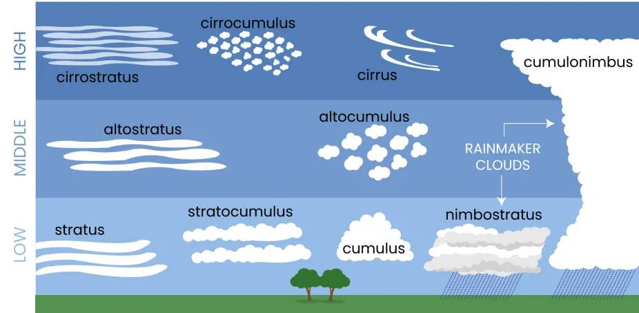
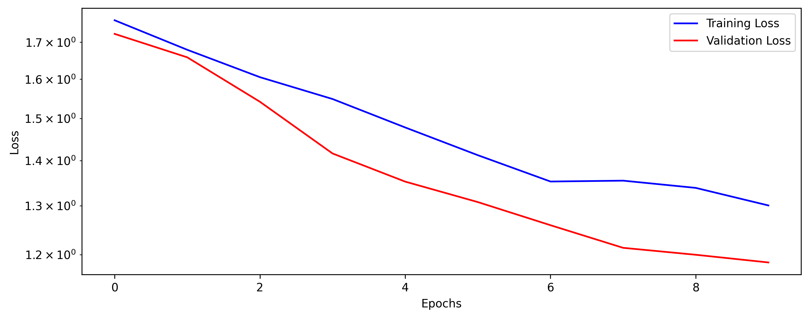
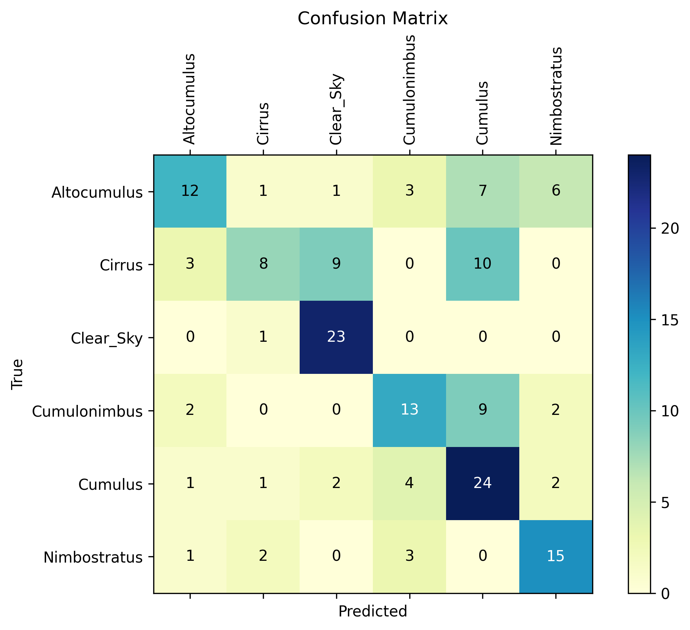
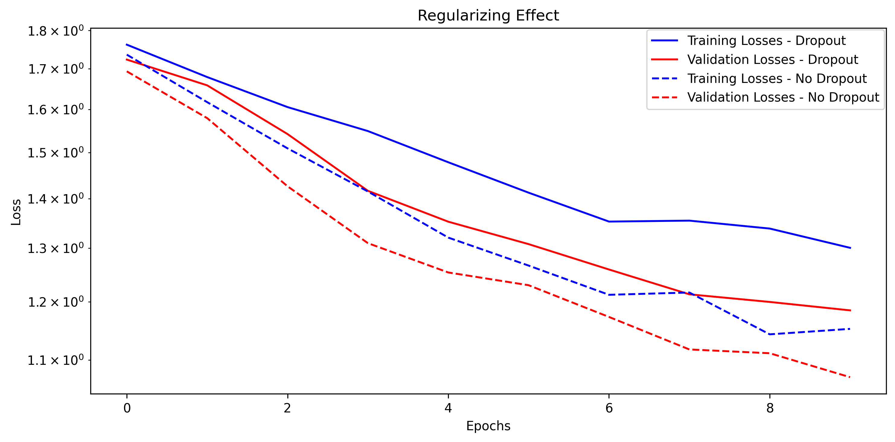
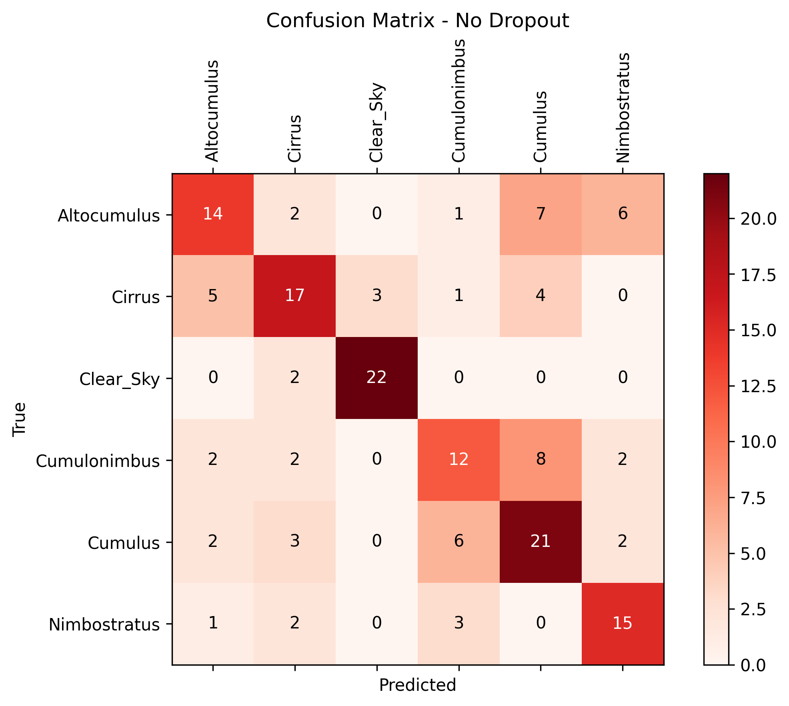
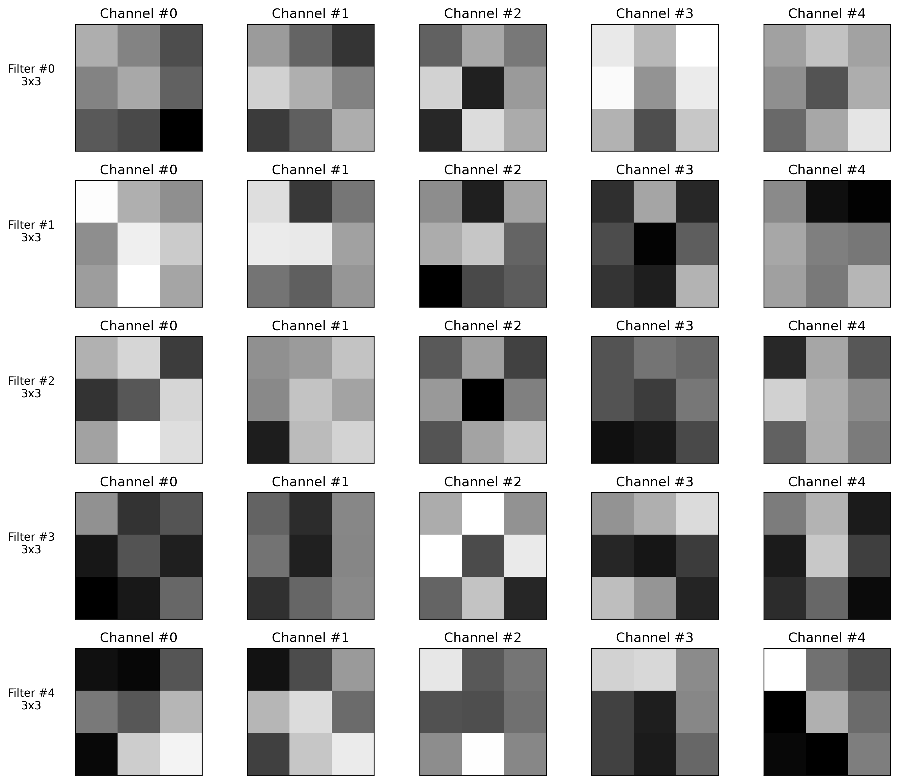

# 🎓 Model Card – Multiclass Classification of Cloud Types

*Professor:* *[Ivanovitch Medieros Dantas da Silva](https://github.com/ivanovitchm)* 

*Student: [Luiz Eduardo Nunes Cho-Luck](https://github.com/eduardocholuck) - 20241012311*

## Overview

This project was developed as Part 1 of the final assessment for the course ***PPGEEC2318 - Machine Learning***. The primary objective of this initial phase was to design four versions to a convolutional neural network for the classification of cloud types based on ground-level imagery. Before proceeding, a brief explanation of clouds and their classifications is provided.

### Clouds and Their Classifications

Clouds are visible collections of water droplets, ice particles, or a combination of both, suspended in the atmosphere. They often also contain particles such as dust, smoke, and industrial residues. Clouds are continuously evolving, frequently changing their shape, size, and appearance, which are mainly determined by two properties: luminance—the amount of light reflected, transmitted, or scattered by cloud particles—and color, influenced by incident light from natural (Sun or Moon) or artificial sources (city lights).

Clouds are classified into three main categories: Upper, Middle, and Lower. The classification is based on the altitude at which the **clouds base** are found. Table 1 presents the most frequent vertical distribution of clouds in the three main regions of the Earth:

```
Table 1 - Most Frequent Vertical Distribution of Clouds

| Layer    | Polar Regions | Temperate Regions | Tropical Region | 
|----------|---------------|-------------------|-----------------|
| Upper    | 3 to 8 km     | 5 to 13 km        | 6 to 18 km      |
| Middle   | 2 to 4 km     | 2 to 7 km         | 2 to 8 km       |
| Lower    | up to 2 km    | up to 2 km        | up to 2 km      |

Source: WMO (1956).
```

Along with their altitude, clouds are also classified based on their shape, which can be seen in Figure 1.


Source: [UCAR CENTER FOR SCIENCE EDUCATION](https://scied.ucar.edu/learning-zone/clouds/cloud-types)

As can be seen in Figure 1, only two types of clouds can produce precipitation: cumulonimbus and nimbostratus. Cumulonimbus clouds are characterized by their tall, vertical shape and are associated with thunderstorms, while nimbostratus clouds are characterized by their flat, horizontal shape and are associated with persistent, widespread precipitation.

## Dataset

* **Original Source**: [Thitinan Kliangsuwan. Cloud Type Classification 3, 2022.](https://kaggle.com/competitions/cloud-type-classification-3) and [Howard-Cloud-X](https://www.kaggle.com/datasets/imbikramsaha/howard-cloudx).

The two original datasets showed several inconsistencies regarding the previously labeled cloud types. Therefore, a manual selection of images was necessary to obtain the best dataset for training and validation. Additionally, due to the similarity between some cloud classes, five types were selected along with the “Clear Sky” class. The chosen classes were: Cirrus, Altocumulus, Cumulonimbus, Cumulus, Nimbostratus, and Clear Sky.

Figure 2 shows a randomly chosen sample from each class, selected from the training data.


Afther this process, the final dataset had a total of 656 images for train and 165 for validation.

## Model 0: Base Model

### Technologies Used

- Python
- PyTorch
- Scikit-learn
- Pandas
- NumPy
- Matplotlib


### Model Description

The CNN2 model is a simple convolutional neural network tailored for image classification tasks with 6 output classes. Its architecture includes:

* **Input**: RGB images (3 channels)

* **Convolutional Layers**: Two convolutional layers, each followed by ```ReLU``` activation and 2×2 ```Max Pooling``` to extract features and reduce dimensionality

* **Dropout**: Optional dropout layers can be applied for regularization

* **Fully Connected Layers**: One hidden (50 units) and one output layer (6 units for class scores)

* **Forward Pass**: Data flows sequentially through the featurizer (convolutions and pooling) and the classifier (fully connected layers)

* **Loss Function**: Cross-Entropy Loss (```nn.CrossEntropyLoss```), suitable for multi-class classification

* **Optimizer**: Adam optimizer (```torch.optim.Adam```), applied to all model parameters

* **Batch Size**: 16

* **Epochs**: 10

* **Validation Strategy**: A validation split was used to monitor model performance during training

* **Number of parameters**: 6976

During training, loss values were monitored across epochs for traing and validation (Figure 3), as you can see below. Furthermore, a confusion matrix was computed to evaluate model performance.





### Results

#### Regular training

To assess the results, a confusion matrix was computed using the validation dataset (Figure 4). The Clear Sky class achieved the highest accuracy, which is unsurprising given that it consists of images with a uniform pattern, making it easier for the model to recognize. In contrast, the Altocumulus, Cirrus, and Cumulonimbus classes showed the lowest performance. Notably, for Cirrus and Cumulonimbus, around 50% of the samples were incorrectly classified as Cumulus, highlighting the model's difficulty in distinguishing between these similar cloud types.



The CCN reached an accuracy of 57%. Even Though this low accuracy, the result is better than others examples of cloud classification that can be found in the Kaggle platform using the originals datasets.


#### Trainig without Dropout

The training after removing the Dropout layer had a slight increase in the accuracy, reaching 61% with the validation set. As espected, the loss in training and validation were less than the previously trainig. 



Besides, as we can see in the confusion matrix (Figure 6) the second training showed betters results in the classes Altocumus and Cirrus, with the last one had a incrise of 8 to 17 right predictions.



#### Visualizing Filters

The ```conv1``` filter visualization (Figure 7) shows 3-channel (RGB) 3×3 kernels that learn low-level features such as edges and color gradients. These weights exhibit clear directional patterns and contrasts typical of early-layer feature detectors.


In contrast, the ```conv2``` visualization (Figure 8) displays 5-channel 3×3 kernels, with each channel corresponding to a feature map output from ```conv1```. These filters capture more abstract, higher-order combinations of the first-layer features. The weights appear less interpretable in isolation, reflecting their role in integrating and recombining simpler patterns into more complex representations useful for classification.



This progression illustrates the hierarchical nature of CNNs: ```conv1``` learns localized, low-level features, while ```conv2``` composes them into richer, more discriminative abstractions.


## Model 1: Base Model + n_feature modification

### Modifications in the CNN 
