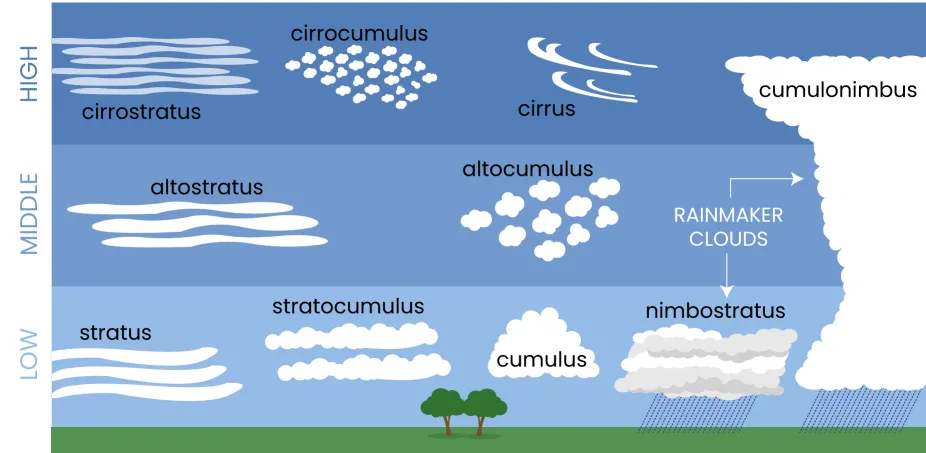

# 🎓 Model Card – Multiiclass Classification of Cloud Types

*Professor:* *[Ivanovitch Medieros Dantas da Silva](https://github.com/ivanovitchm)* 

*Student: [Luiz Eduardo Nunes Cho-Luck](https://github.com/eduardocholuck) - 20241012311*

## Overview

This project was developed as Part 1 of the final assessment for the course ***PPGEEC2318 - Machine Learning***. The primary objective of this initial phase was to design four versions to a convolutional neural network for the classification of cloud types based on ground-level imagery. Before proceeding, a brief explanation of clouds and their classifications is provided.

### Clouds and Their Classifications

Clouds are visible collections of water droplets, ice particles, or a combination of both, suspended in the atmosphere. They often also contain particles such as dust, smoke, and industrial residues. Clouds are continuously evolving, frequently changing their shape, size, and appearance, which are mainly determined by two properties: luminance—the amount of light reflected, transmitted, or scattered by cloud particles—and color, influenced by incident light from natural (Sun or Moon) or artificial sources (city lights).

Clouds are classified into three main categories: Upper, Middle, and Lower. The classification is based on the altitude at which the **clouds base** are found. Table 1 presents the most frequent vertical distribution of clouds in the three main regions of the Earth:

```
Table 1 - Most Frequent Vertical Distribution of Clouds

| Layer    | Polar Regions | Temperate Regions | Tropical Region | 
|----------|---------------|-------------------|-----------------|
| Upper    | 3 to 8 km     | 5 to 13 km        | 6 to 18 km      |
| Middle   | 2 to 4 km     | 2 to 7 km         | 2 to 8 km       |
| Lower    | up to 2 km    | up to 2 km        | up to 2 km      |

Source: WMO (1956).
```

Along with their altitude, clouds are also classified based on their shape, which can be seen in Figure 1.


Source: [UCAR CENTER FOR SCIENCE EDUCATION](https://scied.ucar.edu/learning-zone/clouds/cloud-types)

As can be seen in Figure 1, only two types of clouds can produce precipitation: cumulonimbus and nimbostratus. Cumulonimbus clouds are characterized by their tall, vertical shape and are associated with thunderstorms, while nimbostratus clouds are characterized by their flat, horizontal shape and are associated with persistent, widespread precipitation.

## Dataset

## Model Description

