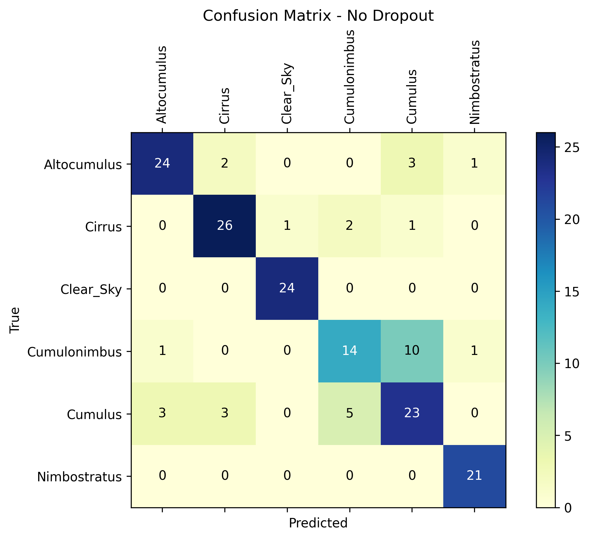

# 🎓 Model Card – Multiclass Classification of Cloud Types

*Professor:* *[Ivanovitch Medieros Dantas da Silva](https://github.com/ivanovitchm)* 

*Student: [Luiz Eduardo Nunes Cho-Luck](https://github.com/eduardocholuck) - 20241012311*

## Overview

This project was developed as Part 1 of the final assessment for the course ***PPGEEC2318 - Machine Learning***. The primary objective of this initial phase was to design four versions to a convolutional neural network (CNN) for the classification of cloud types based on ground-level imagery. Before proceeding, a brief explanation of clouds and their classifications is provided.

### Clouds and Their Classifications

Clouds are visible collections of water droplets, ice particles, or a combination of both, suspended in the atmosphere. They often also contain particles such as dust, smoke, and industrial residues. Clouds are continuously evolving, frequently changing their shape, size, and appearance, which are mainly determined by two properties: luminance—the amount of light reflected, transmitted, or scattered by cloud particles—and color, influenced by incident light from natural (Sun or Moon) or artificial sources (city lights).

Clouds are classified into three main categories: Upper, Middle, and Lower. The classification is based on the altitude at which the **clouds base** are found. Table 1 presents the most frequent vertical distribution of clouds in the three main regions of the Earth:

```
Table 1 - Most Frequent Vertical Distribution of Clouds

| Layer    | Polar Regions | Temperate Regions | Tropical Region | 
|----------|---------------|-------------------|-----------------|
| Upper    | 3 to 8 km     | 5 to 13 km        | 6 to 18 km      |
| Middle   | 2 to 4 km     | 2 to 7 km         | 2 to 8 km       |
| Lower    | up to 2 km    | up to 2 km        | up to 2 km      |

Source: WMO (1956).
```

Along with their altitude, clouds are also classified based on their shape, which can be seen in Figure 1.


Source: [UCAR CENTER FOR SCIENCE EDUCATION](https://scied.ucar.edu/learning-zone/clouds/cloud-types)

As can be seen in Figure 1, only two types of clouds can produce precipitation: cumulonimbus and nimbostratus. Cumulonimbus clouds are characterized by their tall, vertical shape and are associated with thunderstorms, while nimbostratus clouds are characterized by their flat, horizontal shape and are associated with persistent, widespread precipitation.

## Dataset

* **Original Source**: [Thitinan Kliangsuwan. Cloud Type Classification 3, 2022.](https://kaggle.com/competitions/cloud-type-classification-3) and [Howard-Cloud-X](https://www.kaggle.com/datasets/imbikramsaha/howard-cloudx).

The two original datasets showed several inconsistencies regarding the previously labeled cloud types. Therefore, a manual selection of images was necessary to obtain the best dataset for training and validation. Additionally, due to the similarity between some cloud classes, five types were selected along with the “Clear Sky” class. The chosen classes were: Cirrus, Altocumulus, Cumulonimbus, Cumulus, Nimbostratus, and Clear Sky.

Figure 2 shows a randomly chosen sample from each class, selected from the training data.


After this process, the final dataset had a total of 657 images for train and 165 for validation.


## Model description

We've tested 4 versions of a CNN for image classification tasks with 6 output classes.

Some characteristics are shared across all four versions:

* **Input**: RGB images (3 channels)

* **Dropout**: Optional dropout layers can be applied for regularization

* **Fully Connected Layers**: One hidden (50 units) and one output layer (6 units for class scores)

* **Forward Pass**: Data flows sequentially through the featurizer (convolutions and pooling) and the classifier (fully connected layers)

* **Loss Function**: Cross-Entropy Loss (```nn.CrossEntropyLoss```)

* **Batch Size**: 16

Table 2 presents the main differences between the proposed models.

```
Table 2 - Description of the differences in model configurations

| Model Name               | Optimizer | Featues | Conv. Layers | Activation Func.| Parameters | Ephocs |
|--------------------------|-----------|---------|--------------|-----------------|------------|--------|
| Base Model (BM)          |    Adam   |    5    |      2       |       ReLU      |    6.976   |   10   |
| BM + n_feature changes   |    Adam   |   15    |      2       |       ReLU      |   21.566   |   10   |
| BM + conv blocks changes |    Adam   |    5    |      4       |       ReLU      |    7.436   |   10   |
| Personal Model           |    AdamW  |    5    |      2       |        ELU      |    6.976   |   154  |
```

## Results

To avoid a long README file, we will highlight the mainly results. For more details, please acess the notebooks of each experiment in the folder [notebooks](notebooks/).

### Confusion Matrix

Across all four CNN configurations tested, the confusion matrices (Figures 03 to 06) revealed that overall classification performance was strongly influenced by architectural choices such as the number of convolutional layers, the number of feature maps, and the activation function. 

The BM (Figure 03) and BM + n_feature increse (Figure 04) changes generally maintained solid diagonal patterns, showing robust performance despite an increase in parameters when using 15 features.

                Figure 03 - Base Model and Base Model with no Dropout

 

    Figure 04 - BM + n_feature increse  and BM + n_feature increse with no Dropout

 

However, BM + conv blocks changes (Figure 05), with its deeper 4-layer convolutional stack, exhibited clear signs of degradation when dropout was applied—its confusion matrices showed lighter diagonals and more off-diagonal errors, suggesting that excessive regularization in this deeper design led to underfitting.

    Figure 05 - BM + conv blocks changes  and BM + conv blocks changes with no Dropout

 

In contrast, the Personal Model (Figure 06), which combined the AdamW optimizer with ELU activations, consistently delivered the strongest results across all classes, with highly concentrated diagonal entries even with dropout. This suggests that the choice of optimizer and activation function played a key role in improving generalization without sacrificing accuracy.

                          Figure 06 - Personal Model

 

Notably, dropout generally helped reduce minor misclassifications in simpler models but was detrimental in the deeper variant, underscoring that regularization needs to be carefully balanced with model capacity. These findings highlight that even subtle changes in optimizer, nonlinearity, and network depth can have meaningful impacts on CNN performance for multi-class image classification.

### Accuracy

The accuracy results reinforce the trends observed in the confusion matrices (Table 3). The Personal Model achieved the highest accuracy (72%), showing the benefit of combining the AdamW optimizer and ELU activation in improving generalization and class separation. Model 1 slightly outperformed the Base Model (60% vs 57%), suggesting that increasing the number of features can modestly improve representational power. By contrast, Model 2 had the lowest accuracy (32%), indicating that simply deepening the network without careful tuning of regularization and capacity led to underfitting or unstable learning. Overall, these results highlight the importance of architectural and optimization choices in achieving robust performance in multi-class image classification tasks.


```
## Table 3 - Accuracy Results for the Tested Models

|  Model Name    |   Acc  |  Acc - No Dropout  |
|----------------|--------|--------------------|
| Base Model     |  0.57  |        0.61        |
| Model 1        |  0.60  |        0.65        |
| Model 2        |  0.32  |        0.56        |
| Personal Model |  0.75  |        0.80        |
```

### Hooks and Filters

We chose to analyze ```Model 2``` and the ```Personal Model``` because they represent the extremes in performance: ```Model 2``` had the lowest accuracy and showed clear signs of underfitting or poor feature learning, while the ```Personal Model``` achieved the highest accuracy. By comparing their filters and hooks, we can better understand what differentiates well-learned representations from poor ones and gain insights into how architectural choices and regularization affect feature extraction. In particular, by examining the activation maps from both models, we see that the ```Personal Model’s``` two-layer design preserves clearer, well-defined features at each convolutional stage, with evident textural and edge patterns (Figure 07). 

         Figure 07 - Feature Activations Across Layers - Personal Model


In contrast, Model 2, with its deeper four-layer architecture, exhibits increasingly blurred and diffuse activations in the later layers, suggesting over-compression and loss of discriminative information. This difference directly aligns with their classification performance, where the Personal Model achieves significantly higher accuracy by maintaining better hierarchical feature representations.

         Figure 08 - Feature Activations Across Layers - Model 2


## Conclusion

The experiments demonstrate that even small architectural choices and hyperparameter adjustments can have a substantial impact on multiclass cloud classification performance. Models with deeper convolutional stacks require careful tuning of regularization to avoid underfitting or information loss, as seen in Model 2's reduced accuracy and blurred activation maps. In contrast, the Personal Model, combining the AdamW optimizer and ELU activation, achieved the highest accuracy by preserving clear, interpretable features across layers and demonstrating strong generalization. These results highlight the importance of balancing model capacity, activation functions, and optimizers to build effective CNNs for challenging visual classification tasks.
